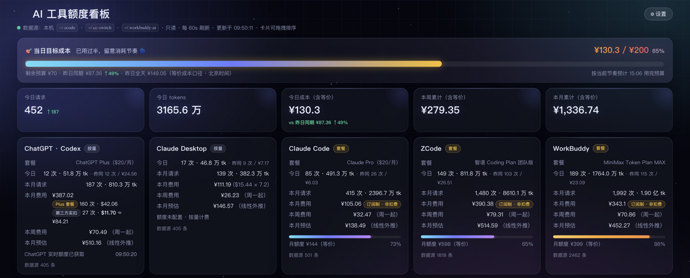
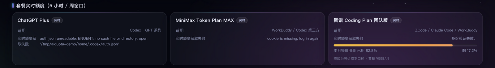
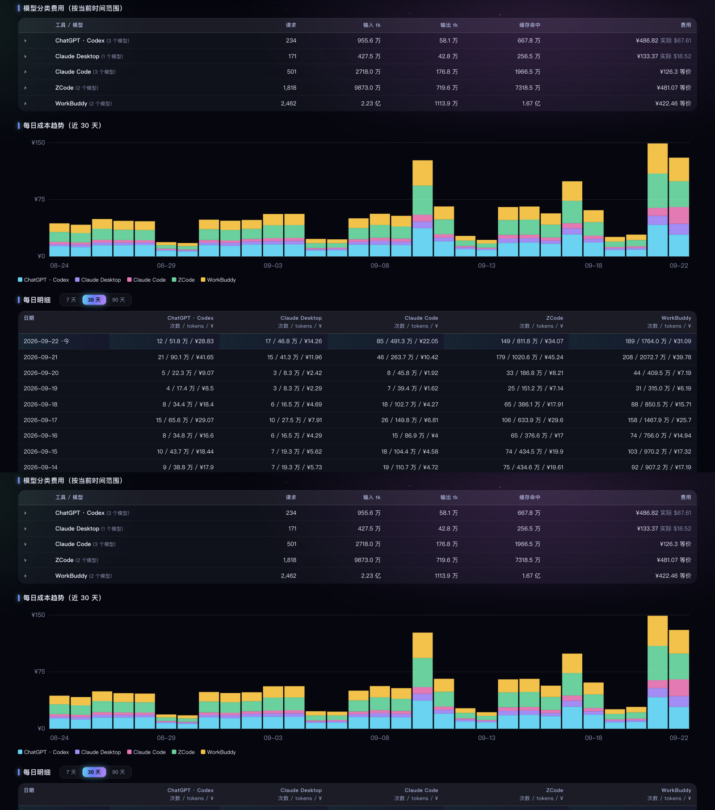
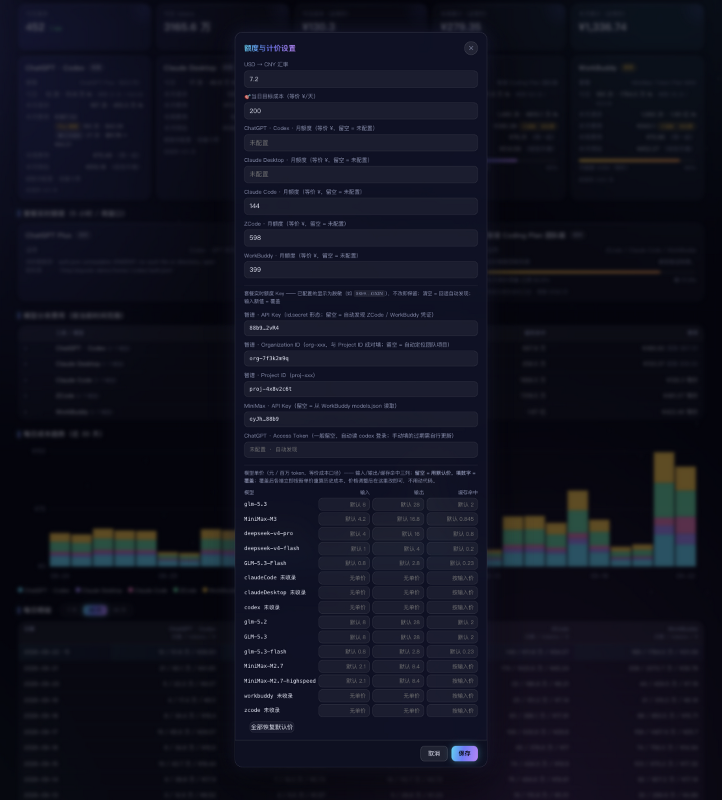

# 🎯 AI 额度看板

[English](README.en.md) | 中文


**每天用 AI 写代码，但你可能说不清：今天烧了多少钱？智谱的 5 小时窗口还剩多少？这个月照这么用下去得花多少？**

这个看板把这些问题变成一屏数字。它蹲在你的电脑里，默默读着 ZCode、Claude Code、Codex、WorkBuddy 的本地记录，算好每一分钱（等价成本）、盯紧每一个额度窗口——**不联网上传任何东西**。



## 它长这样

**各套餐的 5 小时 / 周额度实时进度条**——快用完会变黄变红，带重置倒计时，再也不用登各家官网查额度：



**钱花在哪**：哪个工具、哪个模型、哪天花得多——模型费用排行 + 30 天堆叠趋势 + 每日明细，一屏看全：



**所有东西都能改**：汇率、当日目标成本、月额度、模型单价、额度 API Key（脱敏回显），网页里点开设置就行：



> 📷 以上截图均为**演示数据**（`scripts/gen-demo-data.js` 一键生成），不含任何真实用量。

## ✨ 它能干什么

- 💸 **今天花了多少**：五张工具卡片，今日 / 本月 / 本周费用一目了然；订阅制工具自动折算「等价成本」，和真扣费的工具放在一起比
- ⏳ **额度还剩多少**：ChatGPT、智谱 Coding Plan、MiniMax 的 5 小时窗口和周额度实时进度条，>60% 变黄、>85% 变红，带重置倒计时
- 📈 **照这么用下去要花多少**：月底线性预估；30 天堆叠趋势图 + 每日明细（7/30/90 天切换）
- 🎯 **当日目标成本**：给每天定个 ¥200 的成本目标，横幅里看剩余预算、预计用完时间，菜单栏看百分比，用完/超支弹系统通知提醒（💸）
- 🆚 **和昨天比**：今日同期 vs 昨日同期、昨日全天，一眼看出今天烧得快不快
- 🔌 **MCP Server**：让 ZCode / Claude Code / Codex 直接问你「这周用了多少额度」

## 🚀 30 秒上手

装好 [Node.js 22+](https://nodejs.org)，然后：

```bash
git clone https://github.com/YX-NAS/ai-quota-dashboard.git
cd ai-quota-dashboard
node server/index.js
# 打开 http://localhost:7788 ，完事。
```

零 npm 依赖，不用 `npm install`。首次启动自动生成配置模板，其他都在网页「⚙ 设置」里点。

macOS 懒人一键全套（服务 + 菜单栏 ⚡︎ + 桌面卡片）：

```bash
./start-all.sh     # 可重复执行，已启动的跳过
./stop-all.sh      # 一键全停
```

开机自启：系统设置 → 通用 → 登录项 → 添加 `start-all.sh`。

## 🧰 支持哪些工具

| 用量统计（读本地记录，只读） | 数据来源 |
|---|---|
| ChatGPT · Codex | cc-switch 代理日志（真实 `cost_usd`） |
| Claude Desktop | 同上，按 app_type 自动拆分 |
| Claude Code | `~/.claude/projects/**/*.jsonl` |
| ZCode | `~/.zcode/cli/db/db.sqlite` |
| WorkBuddy | `~/.workbuddy-ai/projects/**/*.jsonl` |

| 套餐实时额度（查得到就显示，查不到就跳过） | 凭证从哪来 |
|---|---|
| ChatGPT（5h + 周） | 自动读 `~/.codex/auth.json`，或设置里手动填 |
| 智谱 Coding Plan 团队版（5h + 周） | ZCode OAuth / WorkBuddy / ZCode 配置自动发现，或手动填 |
| MiniMax Token Plan（5h + 周） | `~/.workbuddy-ai/models.json` 自动发现，或手动填 |

没装的工具？对应卡片安静地不出现，不影响别人。

## 💰 钱是怎么算的（口径很重要）

| 工具 | 口径 |
|---|---|
| Codex / Claude Desktop | 代理日志里的**实际扣费** `cost_usd`，按你设的汇率折算 |
| ZCode / WorkBuddy / Claude Code（套餐路由） | **订阅制**，展示「等价按量成本」（内置单价表 × token），页面会明确标注非实际扣费 |

单价表内置了 GLM / MiniMax / DeepSeek 常见模型（元/百万 token），可以在设置里覆盖；没收录的模型只计 token 不计钱，绝不瞎编。日期全部按北京时间切分。

## 🔌 MCP Server（彩蛋但很好用）

在任何 MCP 客户端注册一次，你的 AI 助手就能随时回答「我这周烧了多少额度」：

```bash
# Claude Code
claude mcp add --scope user ai-quota -- node /path/to/ai-quota-dashboard/mcp/mcp.js
# Codex
codex mcp add ai-quota -- node /path/to/ai-quota-dashboard/mcp/mcp.js
```

提供 `ai_usage_summary` / `ai_usage_today` / `ai_usage_tool` / `ai_usage_models` 四个工具，也能当 CLI 直接跑：

```bash
node mcp/mcp.js today        # 今日简报
node mcp/mcp.js summary 30   # 近 30 天汇总
```

## 🍯 macOS 菜单栏 + 桌面卡片（可选）

- **菜单栏 ⚡︎**：常驻显示今日费用 + 最紧的额度窗口，点开是全部明细，每 5 分钟自刷
- **桌面卡片**：毛玻璃小组件贴在桌面上，可收起、可拖动、位置自动记住

都在仓库里，一条命令编译（需要 macOS + Xcode 命令行工具）：

```bash
cd menubar && swiftc -O -o AIQuota.app/Contents/MacOS/AIQuota menubar.swift
cd desktop && swiftc -O -o AIQuotaWidget.app/Contents/MacOS/AIQuotaWidget desktop-widget.swift
```

## ⚙️ 配置

全部配置存在 `config/plans.json`（首次运行自动生成，已被 gitignore，模板见 [config/plans.example.json](config/plans.example.json)）。推荐直接在网页设置里改，机密字段自动脱敏。

```jsonc
{
  "usdCnyRate": 7.2,                    // 汇率
  "plans": { "zcode": { "cnyPerMonth": 598 } },  // 各工具月额度（等价 ¥）
  "priceOverrides": { "glm-5.3": { "in": 8, "out": 28, "cacheRead": 2 } },
  "quotaKeys": { "zhipu": { "token": "" } },      // 实时额度凭证，留空 = 自动发现
  "dailyGoal": { "cny": 200 }           // 当日目标成本
}
```

## 🧪 测试

```bash
node test/run-tests.js                  # 单元测试（计价 / 聚合 / 预估）
python3 test/verify-against-sources.py  # 独立复算今日数据，和页面对账
```

## ❓ FAQ

**某个工具卡片没数据？**
没装这个工具，或它还没有使用记录，采集器自动跳过。可以确认下数据源路径是否存在（见上文表格）。

**macOS 上读文件失败 / 数据为空？**
八成是 macOS 隐私保护拦了。去「系统设置 → 隐私与安全性 → 完全磁盘访问权限」，把你启动服务的终端 App（或 node）加进去，重启服务。

**实时额度显示「不可用」？**
手动填的 token 过期了。去设置里清空对应 Key（回退自动发现），ChatGPT 也可以重跑 `python3 scripts/sync-chatgpt-token.py`。这些额度接口是厂商非公开端点，接口变了看板会自动降级为仅本地统计，用量和成本不受影响。

**7788 端口被占了？**
自动往后找空位（最多 20 个），实际地址印在启动日志里。

**数据准不准？**
和原始库逐条对得上。跑 `python3 test/verify-against-sources.py` 独立复算任意一天，和页面对账。

**能部署到服务器 / 局域网共享吗？**
它是单机工具：数据在各自主机的用户目录里，服务只监听 `127.0.0.1`。多机就每台跑一份；真要远程看，自己加反向代理和鉴权。

## 🔒 隐私与安全

- 所有采集**只读**，绝不写任何工具的数据库
- API Key / OAuth Token 只存本机 `config/plans.json`，接口返回自动脱敏
- 服务只监听 `127.0.0.1`，外面访问不到
- 不上传、不同步、不打点——你的用量数据只属于你

## 📂 目录结构

```
server/index.js         HTTP 服务 + 60s 定时刷新
server/collectors/      4 个用量采集器 + 3 个实时额度采集器
server/lib/             计价 / 聚合 / 配置
web/                    前端单页（零依赖）
mcp/mcp.js              MCP Server（兼 CLI）
menubar/ desktop/       macOS 菜单栏与桌面组件（Swift，可选）
config/plans.json       用户配置（自动生成，不进版本库）
test/                   单元测试 + 数据核验
docs/                   设计文档 + 截图
```

## License

[MIT](LICENSE)
