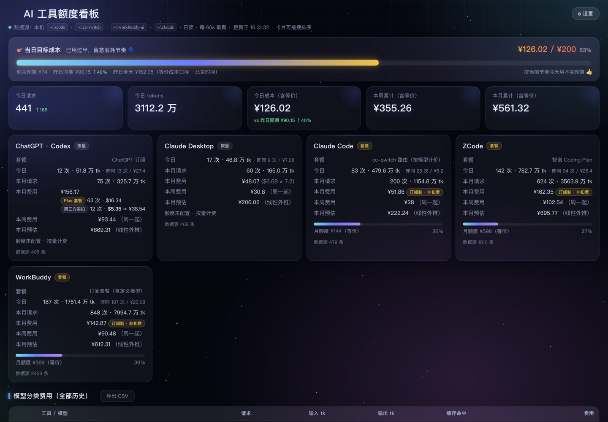
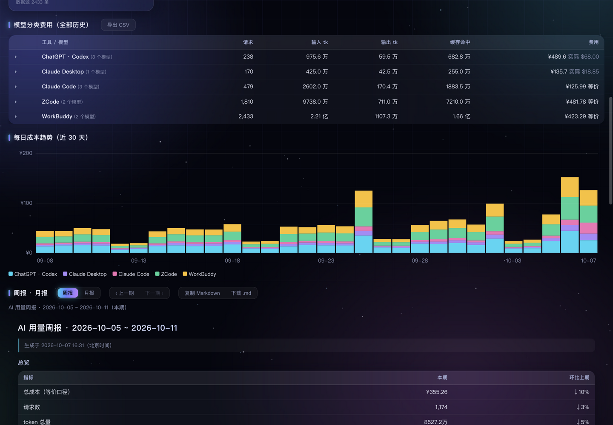
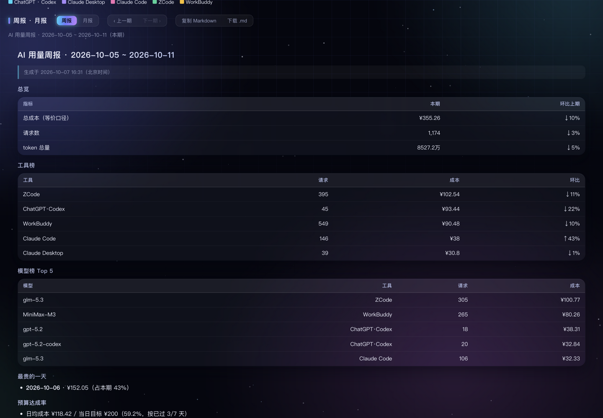
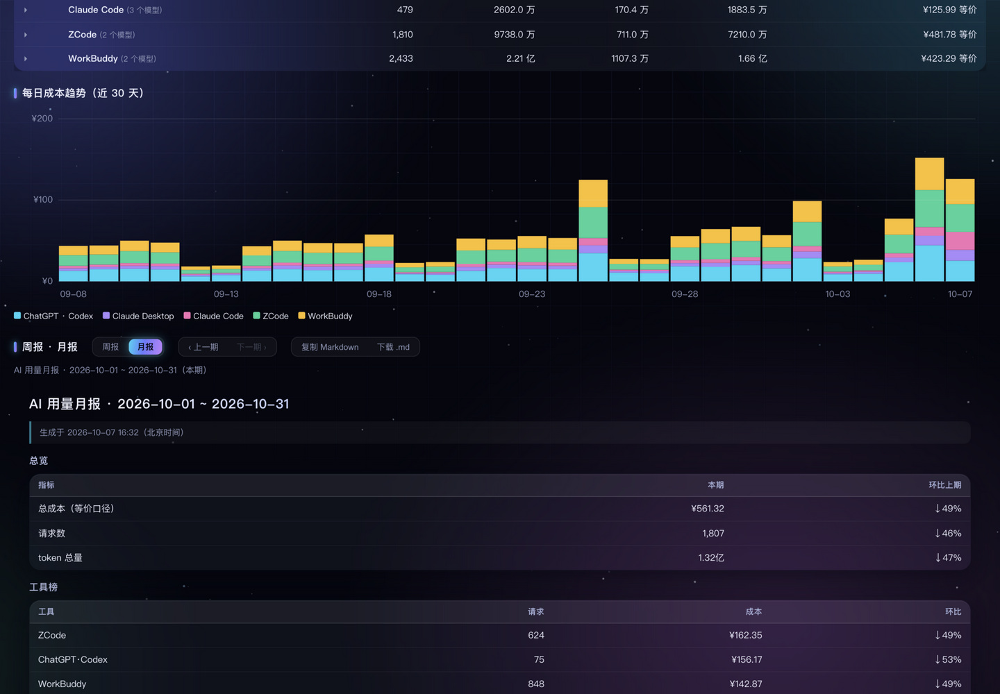
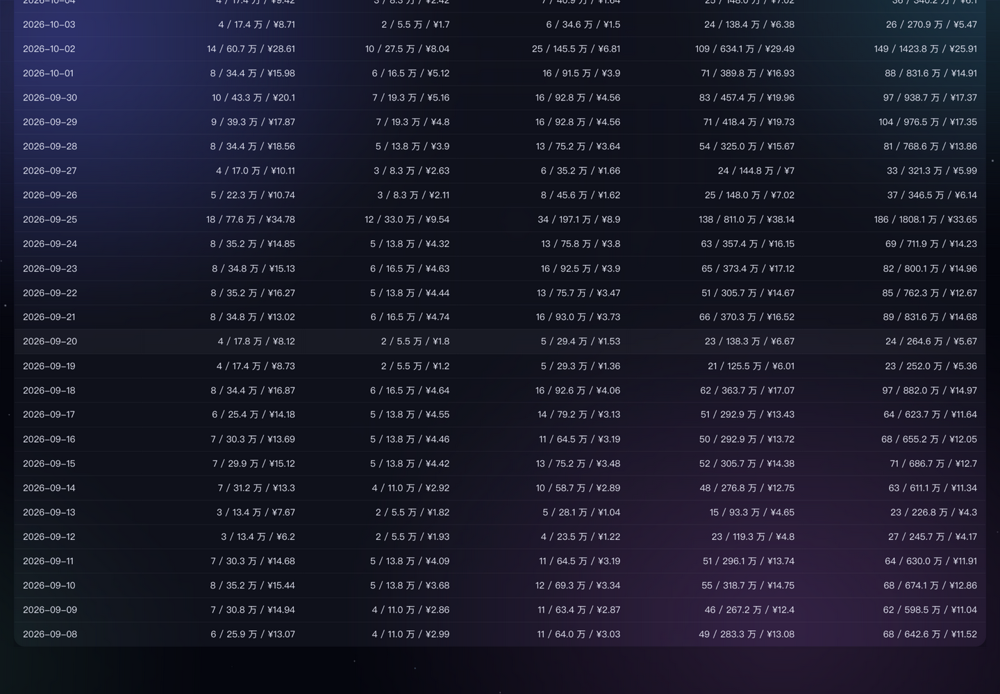
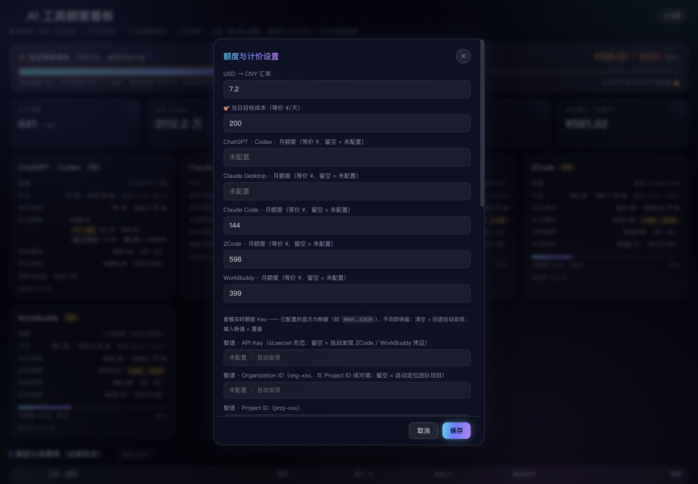
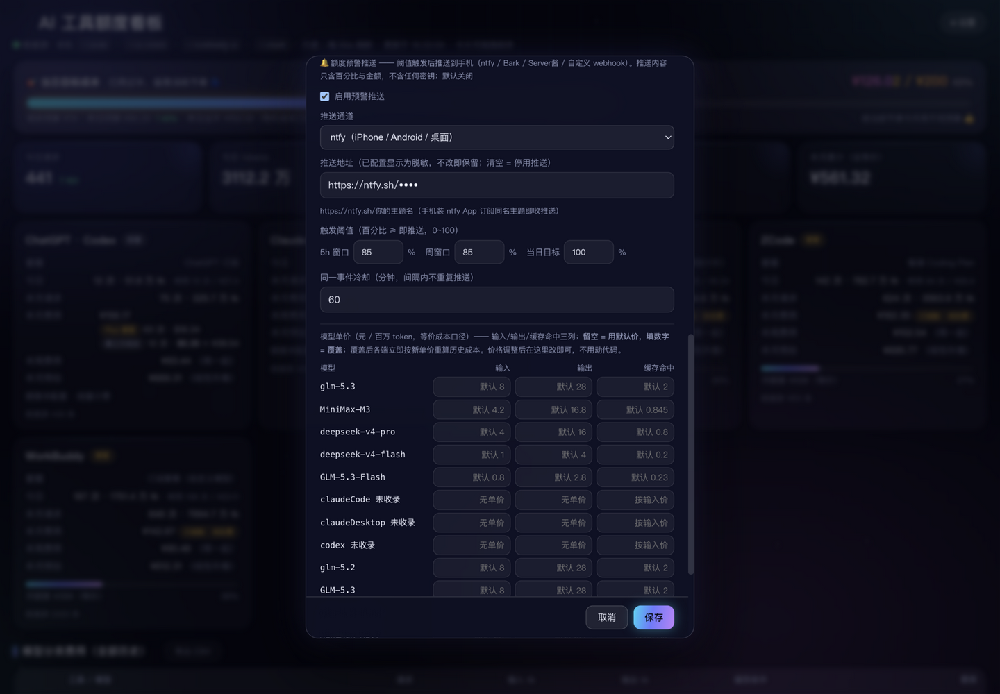

# 📖 AI 额度看板 · 图文上手手册

写给第一次用的你：不用懂编程，跟着手册一步步点，10 分钟从零到会用。

> 📷 手册里的 7 张截图均为**演示数据**（仓库自带 `scripts/gen-demo-data.js` 一键生成），不含任何真实用量。你看到的数字和截图不一样，是正常的。

## 目录

1. 它是干嘛的
2. 准备：装 Node.js
3. 三步启动
4. 看懂看板（重点）
5. 周报 · 月报
6. 每日明细与历史数据
7. 设置面板怎么用
8. 额度预警推送到手机
9. 菜单栏 / 托盘 / 桌面卡片（可选）
10. 让 AI 助手替你看（MCP）
11. 常见问题 FAQ
12. 隐私说明

---

## 1. 它是干嘛的？

这章你将用 30 秒决定要不要装它。

一句话：**一个装在你自己电脑上的网页，把你所有 AI 编程工具的花销和额度摆到一屏里。**

- 今天/本月花了多少钱、每个工具各花多少，自动算好；
- ChatGPT、智谱、MiniMax 的 5 小时窗口和周额度还剩多少，实时进度条；
- 用量快到上限时，推送一条预警到你手机，不用自己盯着。

它认识这些工具（没装的自动跳过，绝不显示假数据）：

| 工具 | 数据从哪来 |
|---|---|
| ChatGPT · Codex | cc-switch 代理日志（真实扣费） |
| Claude Desktop | 同上，自动拆分 |
| Claude Code | 本地 `~/.claude` 记录 |
| ZCode | 本地 `~/.zcode` 数据库 |
| WorkBuddy | 本地 `~/.workbuddy-ai` 记录 |

它只读取本机文件，不上传任何数据。想卸载也简单：关掉服务、删掉项目文件夹即可，不留任何残留。

## 2. 准备：装 Node.js

这章你将确认电脑上有一份能跑看板的 Node.js。

Node.js 是看板的运行环境（类似「发动机」），只需装一次。

1. 打开 [nodejs.org](https://nodejs.org)，下载 **22.13 或更高**的 LTS 版安装包（看板用到 Node 22 自带的 SQLite 能力，老版本跑不起来）。macOS 下 `.pkg`、Windows 下 `.msi`，对号入座。用 Homebrew 的 macOS 同学也可以 `brew install node@22`。
2. 双击安装，一路下一步。
3. 验证：打开终端（macOS 在「应用程序 → 实用工具 → 终端」；Windows 按 `Win+R` 输入 `cmd` 回车），输入：

```bash
node -v
```

4. 看到 `v22.13.0` 或更高（`v` 开头即正常）就绪；若显示更低版本或「不是内部或外部命令」，回官网重装最新 LTS，装完重开终端再试。

## 3. 三步启动

这章你将把看板跑起来，并在浏览器里打开它。

1. **拿到代码**（二选一）：

```bash
# 方式 A：会用 git 的话
git clone https://github.com/YX-NAS/ai-quota-dashboard.git
cd ai-quota-dashboard
```

   方式 B：打开仓库网页 → 绿色 `Code` 按钮 → `Download ZIP` → 解压，终端里 `cd` 进入解压出的文件夹（`cd` 就是「进入这个文件夹」的命令）。

2. **启动服务**（在项目文件夹里执行）：

```bash
node server/index.js
```

   零依赖、不用 `npm install`；首次启动自动生成配置模板。**注意：这个终端窗口要一直开着**（最小化可以，关掉服务就停了）；停止服务按 `Ctrl+C`。

3. **打开看板**：浏览器访问 <http://localhost:7788>，完事。

懒人可选——一键带起服务 + 菜单栏/托盘 + 桌面卡片：

```bash
./start-all.sh      # macOS / Linux（可重复执行，已启动的自动跳过）
.\start-all.cmd     # Windows（双击也行）
```

停止用 `./stop-all.sh`（Windows：`.\stop-all.cmd`）。

**以后要更新版本**：在项目文件夹里 `git pull`（zip 下载的重新解压覆盖），再重启服务即可——你的设置和历史都在 `config/` 目录里，更新不会动它们。

开机自启（macOS）：系统设置 → 通用 → 登录项 → 添加 `start-all.sh`；Windows：`Win+R` 输入 `shell:startup`，放入 `start-all.cmd` 的快捷方式。更多见 [README](../README.md)。

## 4. 看懂看板（重点）

这章你将认识页面上的每一个区块，以及三个最常用的术语。

页面从上到下依次是：目标横幅 → 今日 KPI → 工具卡片 → 模型费用 → 趋势图 → 周报月报 → 每日明细。60 秒自动刷新，不用手动 F5。


*图 1：页面顶部。重点看三处：最上面的当日目标横幅（63% 进度）、中间一排今日 KPI、下面的工具卡片（每张卡底部有月额度进度条）。*

**① 当日目标横幅**：你给每天定的成本预算（默认 ¥200，可在设置改）。横幅显示今天已用百分比、剩余预算、按当前节奏预计几点用完。用完/超支会弹系统通知（💸）。

**② 今日 KPI**：今日请求数、今日 token 数、今日成本、本月成本，一眼扫完。

> 💡 **术语：token**——AI 模型计费的最小单位，约等于零点几个汉字。一次对话动辄几千上万 token，「token 数」就是衡量你用得多猛的尺子。

**③ 工具卡片**：每个工具一张卡——今日 / 本周 / 本月费用、和昨天同期的对比（今天烧得快不快）、月底预估（照当前节奏这个月会花多少），以及月额度进度条。没装的工具折叠成一行「未启用的工具」。

> 💡 **术语：等价成本**——智谱 Coding Plan、WorkBuddy 这类**订阅制**工具不按条扣钱，看板按厂商公开单价把 token 折算成「如果按量计费要花多少」，方便和真扣费的工具放在一张表里比。它是估算口径，卡片上有标注，**不是实际账单**。

**④ 套餐额度进度条**：ChatGPT / 智谱 / MiniMax 的实时额度，绿色健康、>60% 变黄、>85% 变红，带重置倒计时。查不到凭证的额度卡不显示，不会给你看假错误。

> 💡 **术语：5h 窗口**——厂商给你的用量额度每 **5 小时滚动重置**一次，窗口内用超会被限速；「周窗口」同理，7 天一重置。进度条到了红色就该歇一歇或换个工具了。


*图 2：模型分类费用表（哪个模型烧钱最多）+ 30 天堆叠趋势图（哪天烧得多）。趋势图每个柱子按工具分色堆叠，一眼看出某天的尖峰是谁贡献的。*

**⑤ 模型费用表**：按模型分类的费用排行。没收录单价的模型只计 token 不计钱（标「无单价」），绝不瞎编数字。

**⑥ 我看到的钱是怎么算的**（口径速查）：

| 工具 | 金额含义 |
|---|---|
| Codex / Claude Desktop | 代理日志里的**实际扣费**（美元），按你设的汇率折成元 |
| ZCode / WorkBuddy / Claude Code（套餐路由） | **等价成本**（内置单价 × token），非实际扣费 |
| 未收录单价的模型 | 只计 token，不计钱 |

小技巧：工具卡片和额度卡都能**按住拖动排序**，把最关心的拖到最前面，顺序会自动记住。

## 5. 周报 · 月报

这章你将学会看环比，并把报告一键复制进周会文档。


*图 3：周报区块（在趋势图下方）。重点看总览环比表——成本、请求、token 都和上一期比；下面是工具榜、模型榜 Top5 和预算达成率。*

1. 在趋势图下方找到「周报 · 月报」区块，点**周 / 月**切换口径（周 = 北京时间 ISO 周，**周一起算**；月 = 自然月）。
2. 点**上一期 / 下一期**翻历史周期（周报最多回看 520 期、月报 120 期，约十年）。报告数据同样来自「实时扫描 + 归档」合并——只要历史沉淀过，翻去年同期的周报也有数。
3. 点**复制 Markdown**，直接粘贴到周会文档 / 群里；或点**下载 .md** 存档。

报告共七节，从上到下：

| 节 | 看什么 |
|---|---|
| 标题 | 周期起止日期（本期是哪几天） |
| 总览 | 成本·请求·token，**环比**= 和上一个同样长的周期比 |
| 工具榜 | 每个工具本期的费用与占比 |
| 模型榜 Top5 | 最烧钱的五个模型 |
| 最贵的一天 | 本期峰值日——哪天冲得太猛 |
| 预算达成率 | 本期费用 ÷ 月额度折算，花超了会亮红 |
| 口径脚注 | 等价成本 / 归档等口径说明，汇报时不用自己解释 |


*图 4：月报口径，同一区块切到「月」。*

复制出来的 Markdown 长这样（示例节选，直接能贴）：

```markdown
## 总览
| 指标 | 本期 | 环比上期 |
| --- | --- | --- |
| 成本 | ¥386.42 | +12.3% |
...
## 工具榜
| 工具 | 请求 | 成本 | 环比 |
```

给程序员的接口：`GET /api/report?type=week|month&offset=N`（offset=1 即上一期）；MCP 工具 `ai_usage_report`；CLI 见第 10 章。

## 6. 每日明细与历史数据

这章你将学会切换明细的时间范围、导出 CSV，并弄懂「全部（归档）」是什么。


*图 5：每日明细表。右上角可切 7 / 30 / 90 / 全部（归档），旁边是导出按钮。*

1. **切换范围**：默认 30 天；选「全部（归档）」可看到最多 10 年（3650 天）的历史。
2. **导出**：点导出按钮得到 CSV（带 BOM，Excel 双击直开不乱码）；整份快照也能导出 JSON。

**「归档」是什么**：各家工具的原始日志会滚动清理，删掉就找不回来了。所以每次构建，看板把每日汇总自动写进 `config/history.sqlite` 这个**本地归档库**——原始日志没了，历史照样在。默认开启；想回到纯实时扫描，启动前设置环境变量 `AI_QUOTA_HISTORY=0`。

两个诚实的说明：

- 改过单价后，归档的历史成本会**按当前单价重估**（历史跟随新价）；真实扣费（如 Codex 的 cost_usd）部分**不会**被重估。
- 归档库万一损坏，看板自动降级为纯实时扫描，不影响其他功能。

想备份历史？停掉服务后把 `config/history.sqlite` 拷走即可（旁边的 `-wal` / `-shm` 是它的伴生文件，一起拷更稳）。

顺带认识一下 `config/` 目录——你的全部「家当」都在这，换电脑时整个拷走就能无缝迁移：

- `plans.json`：全部设置（汇率、目标、额度、单价、预警配置）
- `history.sqlite`：历史归档库
- `.port`：服务实际监听的端口（菜单栏 / 托盘靠它自动跟随）

## 7. 设置面板怎么用

这章你将学会改汇率、目标、月额度、凭证和单价。


*图 6：设置面板上半部分——汇率、当日目标、各工具月额度、实时额度 Key。下半部分是预警推送（下一章）。*

点页面右上角 **⚙ 设置**，常用的几项：

| 想改什么 | 在哪改 | 说明 |
|---|---|---|
| 汇率 | 汇率（USD→CNY） | 默认 7.2，影响美元成本折算 |
| 当日目标 | 当日目标成本 | 填 0 = 关闭目标横幅 |
| 月额度 | 各工具月额度（等价 ¥） | 工具卡片底部进度条的分母 |
| 实时额度凭证 | 实时额度 Key | 留空 = 自动发现；填错可清空恢复自动 |
| 模型单价 | 单价覆盖 | 覆盖内置单价表（元 / 百万 token） |

改完点保存**立即生效**（服务马上按新配置重算，不用重启）。

**Key 的脱敏规则**（很重要）：凭证保存后界面只显示 `abcd…wxyz` 这样的掩码。**掩码原样保存 = 保留原值，清空 = 停用**（回退自动发现）。想换新 Key 直接粘贴新值覆盖即可。

**覆盖一个模型单价**的完整走位：

1. 设置 → 找到「单价覆盖」→ 添加一行。
2. 填模型名（要和页面模型费用表里的名字一致，如 `glm-5.3`）。
3. 填单价：输入 `in`、输出 `out`、缓存读 `cacheRead`、缓存写 `cacheWrite`（元 / 百万 token）。
4. `cacheWrite` 可以不填——缺省按输入价计；只有缓存写入价和输入价不同的模型才需要单独填。
5. 保存，页面各处金额立即按新单价重算。

## 8. 额度预警推送到手机

这章你将把预警接到手机上：用量逼近上限时收一条推送。


*图 7：设置面板下半部分——「额度预警推送」区。默认关闭；开启后选通道、填地址、调阈值与冷却。*

**先懂语义再动手**：

- **三个阈值**：5h 窗口用量百分比（默认 85%）、周窗口百分比（默认 85%）、当日目标百分比（默认 100%），范围 0~100。达到或超过才触发——85% 意味着给你留 15% 的缓冲，想早点被提醒就调低。
- **冷却**：同一事件在冷却时间内（默认 60 分钟）不重复推。窗口重置后算**新事件**，会重新预警。
- **触发时机**：看板服务每 60 秒重建一次数据，随后评估。**服务没开就不推**。一轮最多 7 类事件（3 家额度 × 5h/周两个窗口 + 当日目标）。
- 推送内容只有百分比 / 金额 / 倒计时，**绝不含密钥或 token 明细**。

**通道一：ntfy（推荐，iPhone / Android / 桌面全支持，免费）**

1. 手机装 ntfy App（App Store / Google Play 搜 `ntfy`；电脑浏览器打开 <https://ntfy.sh> 也行）。
2. 在 App 里点 **+** 订阅一个自己起名的主题，要够随机，如 `ai-quota-x7k9qm`（主题名就是密码，别用别人猜得到的）。
3. 回到看板设置：「额度预警推送」→ 打开「启用」→ 通道选 **ntfy** → 推送地址填 `https://ntfy.sh/ai-quota-x7k9qm`。
4. 保存。测试：临时把 5h 阈值调到当前用量以下，一分钟内手机应收到推送；测完改回 85。

**通道二：Bark（iOS）**

1. App Store 装 Bark，打开 App，复制它给出的专属地址（形如 `https://api.day.app/你的Key`）。
2. 看板里通道选 **Bark**，粘贴该地址，保存。

**通道三：Server酱（微信）**

1. 打开 <https://sct.ftqq.com>，微信扫码登录，复制页面上的 SendKey。
2. 看板里通道选 **Server酱**，推送地址填 `https://sctapi.ftqq.com/你的SendKey.send`，保存。推送由「方糖」服务号送达微信。

**通道四：通用 Webhook**

1. 准备一个能接收 POST JSON 的接口（自建通知服务、企业内网机器人等）。
2. 看板里通道选 **通用 Webhook**，填接口 URL，保存。

**通道选择建议**：手里只有 iPhone → Bark 最省事；Android 或多设备都要收 → ntfy；只想收在微信里 → Server酱。

推送地址与额度 Key 同语义：**掩码原样保存 = 保留，清空 = 停用**。

## 9. 菜单栏 / 托盘 / 桌面卡片（可选）

这章你将知道除了网页，还有三种常驻形态。

- **macOS 菜单栏 ⚡︎**：常驻显示今日费用 + 最紧的额度窗口，点开是全部明细，每 5 分钟自刷；**桌面卡片**：毛玻璃小组件贴桌面，可收起、可拖动。`./start-all.sh` 一键带起，编译方法见 [README](../README.md)。
- **Windows 托盘 ⚡ + 桌面卡片**：`start-all.cmd` 自动带起，无需编译。托盘圆盘颜色随当日目标变绿/橙/红，悬停看今日费用，目标过半/用完弹系统通知。也可单独启动：

```powershell
powershell -NoProfile -ExecutionPolicy Bypass -File menubar\tray.ps1     # 托盘
powershell -NoProfile -ExecutionPolicy Bypass -File desktop\widget.ps1   # 桌面卡片
```

## 10. 让 AI 助手替你看（MCP）

这章你将让 ZCode / Claude Code / Codex 能直接回答「我这周烧了多少额度」。

在任何 MCP 客户端注册一次看板自带的 MCP Server（含 `ai_usage_report` 在内 6 个工具），你的 AI 助手就能随口报数；注册方法见 [README 的 MCP 章节](../README.md#-mcp-server彩蛋但很好用)。也能当命令行直接跑：

```bash
node mcp/mcp.js today          # 今日简报
node mcp/mcp.js report week 1  # 上一周的周报
node mcp/mcp.js report month   # 本月月报
```

## 11. 常见问题 FAQ

这章你将按症状对号入座找到解法。

**某个工具卡片没数据？**
没装这个工具，或它还没有使用记录——采集器自动跳过，零用量卡片折叠成一行，不会报错。

**实时额度显示「不可用」？**
多半是手动填的 token 过期了：去设置里**清空**对应 Key（回退自动发现）。这些额度接口是厂商非公开端点，接口一变看板会自动降级为仅本地统计，用量和成本不受影响。

**收不到预警推送？按顺序排查：**
1. 「启用」开关开了吗？保存成功了吗？
2. 通道和地址匹配吗？（ntfy 的地址填进了 Bark 通道就不通）
3. 地址抄全了吗？（Bark / Server酱 的 Key 很容易少复制几位）
4. 阈值到了吗？（当前用量百分比低于阈值不会推，可临时调低阈值测试）
5. 冷却中吗？（同一事件在冷却分钟数内只推一次，等等或调小冷却）
6. 通道本身通吗？（浏览器打开 ntfy 主题页发条测试消息，手机能收到说明通道没问题）

**打不开 localhost:7788？**
7788 被占会自动往后找空位（最多 20 个），实际地址印在启动日志里，翻一下终端。也检查下启动服务的终端窗口是不是被你不小心关了——关了服务就停了，重新执行启动那一步即可。

**页面顶部出现「看板服务未响应」横幅？**
服务停了或正在首次构建（第一次要扫全部历史，稍慢）。先等十几秒点横幅上的重试；不行就回终端看服务是否还活着、按 `Ctrl+C` 后重新 `node server/index.js`。

**Windows 首次启动弹防火墙提示？**
node 第一次监听端口时 Windows 会问一次「允许访问」，点允许即可（服务只监听本机 127.0.0.1，勾不勾「专用网络」都不影响）。

**macOS 上数据是空的？**
系统隐私保护拦了：系统设置 → 隐私与安全性 → **完全磁盘访问权限**，把你启动服务的终端 App（或 node）加进去，重启服务。

**项目放在网盘 / 同步盘（iCloud、SynologyDrive 等）里？**
归档库是 SQLite，云同步可能把它的 WAL 文件撕坏。建议把配置目录指到本地盘再启动：

```bash
export AI_QUOTA_CONFIG_DIR=~/ai-quota-config   # Windows: set AI_QUOTA_CONFIG_DIR=C:\ai-quota-config
node server/index.js
```

**工具日志被清理了，历史还在吗？**
在。历史已沉淀进 `config/history.sqlite`，明细表切「全部（归档）」就能看。除非你设了 `AI_QUOTA_HISTORY=0`（此时冷却记录也只存内存，重启后同会重推一次预警）。

**「全部（归档）」能追到多久以前？**
升级到本版后第一次构建就会沉淀最近一年的历史（原始日志还在的范围内）；更早的、日志已被工具清掉的日子救不回来——归档只能从启用那天起越攒越厚。

**改了单价，历史金额跟着变了，正常吗？**
正常。等价成本口径下，归档历史按**当前单价**重估（口径统一，方便看趋势）；真实扣费的部分不受影响。

**数据准不准？**
和原始库逐条对得上。跑 `python3 test/verify-against-sources.py` 可独立复算任意一天，和页面对账。

**能部署到服务器、给全组看吗？**
它是单机工具：数据在各自主机的用户目录里，服务只监听 `127.0.0.1`。多机就每台跑一份；真要远程看，自己加反向代理和鉴权。

## 12. 隐私说明

这章你将看清它对你的数据做了什么、没做什么。

- **只读本机**：所有采集只读，绝不写任何工具的数据库；服务只监听 `127.0.0.1`，外面访问不到。
- **不上传**：不联网上传、不同步、不打点，你的用量只属于你。
- **密钥脱敏**：API Key / Token 只存本机配置文件，界面与接口一律掩码显示；预警推送地址同样只显示掩码。
- **推送不含明细**：预警推送只有百分比、金额、倒计时，没有密钥、没有 token 明细。

---

遇到别的坑？先翻 [README](../README.md) 的 FAQ，再欢迎提 Issue。
